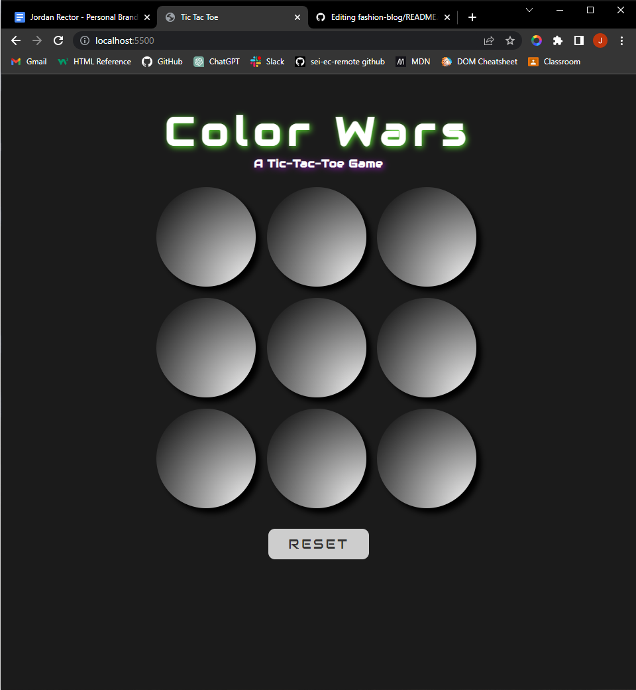

# Color Wars
## A Tic-Tac-Toe Game

### Link: 

[GitHubPagesLink](https://rectorjordan94.github.io/ttt-project/)

### Technologies Used:

- HTML
- CSS
- JavaScript

### How to Play:

The game automatically alternates between player one & player two's choices, the first click is player one, second is player two, third is player one again, etc.

At the beginning of the game, player one is assigned a random color and player two is assigned its complementary color, and each time either player clicks the circles on the board will change color to correspond with their respective player color.

The game follows standard tic-tac-toe rules: once either player gets three in a row (in a row, column, or diagonal), that player wins! If neither player is able to get three in a row in any combination, the game will result in a tie.

After the game ends, simply click reset to play again (the game will assign new random colors for each player on every reset).

### Functions:

`isInCombo()` - accepts two arrays as arguments, checks to see if player moves and win conditions match

`randomizeColors()` - returns a random rgb color and its complementary color

`resetGrid()` - gets new random player colors, sets the title & subtitle shadows to match the respective player colors, makes all the circles in the grid clickable again, styles the circles back to their default colors, sizing, innerHTML, and opacity. Also empties the player moves arrays and sets the moveCounter to 0

`makeMove()` - detects if it is an even or odd turn (odd is player one, even is player two), changes selected circle to match player color, makes clicked circle unclickable, and adds the id of the circle clicked to the respective player's moves array. Also detects if it is the last move of the game and checks to see if the game is a tie in which case it alternates the colors of every circle to match both player colors, then clears all the circles out except for the middle circle which increases 3x and prints 'TIE'

`checkWin()` - runs the `isInCombo()` function to check if the player moves match any of the win conditions, if player one wins it changes all the circle colors to match the player color briefly then sets the opacity of all circles except for the middle circle to zero and scales the middle circle up 3x and print's 'Player One Wins', and vice versa

`gameOver()` - makes all circles unclickable by adding the 'hasBeenClicked' class, which sets pointer-events to none

